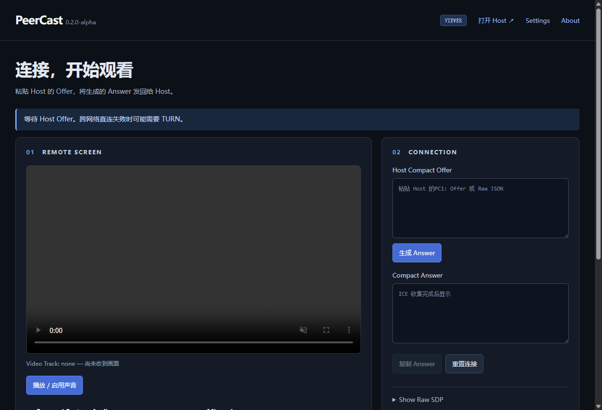
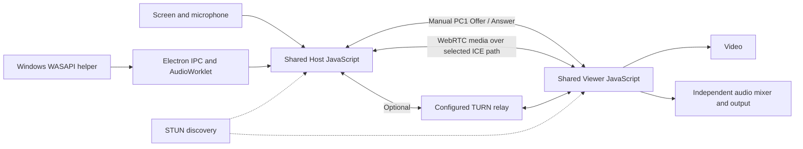

# PeerCast


[](LICENSE)

**One-to-one screen sharing with independently controlled audio sources.**

PeerCast combines a plain JavaScript WebRTC application, an Electron Windows
desktop shell and a C# WASAPI process-loopback helper. A Host shares a screen or
window; a Viewer watches and adjusts each audio source independently. Users
exchange compressed Offer/Answer codes manually.

This is an **alpha engineering project**, not a production conferencing service.
There are no accounts, signaling backend, database or project-operated media
servers. Optional user-configured TURN can relay media. The interface is primarily
Chinese, with English technical labels.

## Core features

- Separate Host/Viewer state machines and complete ICE gathering before export.
- Screen/window sharing, microphone selection and optional mixed system audio.
- Genuine Windows process-tree audio capture with independent Send, Mute and Volume.
- Viewer audio mixer and output-device selection where supported.
- `PC1:` gzip/Base64URL connection codes, Raw SDP compatibility, clipboard fallbacks.
- Configurable STUN/TURN and selected-candidate route diagnostics.
- Auto / 720p / 1080p / Native resolution and 30 / 60 FPS requests, with actual
  capture, sent/received FPS, bitrate, packet loss and RTT reporting.
- Local settings, startup OFF by default, optional tray behavior and NSIS installer.

Local browser regression, desktop IPC checks and native audio isolation tests with
two synthetic tone processes have passed. Real CS2/Discord isolation, cross-network
media reliability and sustained 1080p60 remain **NEEDS MANUAL TEST**.

## Screenshots

The [screenshot guide](docs/screenshots/README.md) reserves Windows Host, Viewer
and Application Audio views and identifies missing captures. Only reviewed images
of actual application windows are included; no mockup is presented as a real call.



*Actual Windows Viewer UI in an idle state; this is not a connected call.*

## Architecture



Web and Desktop share the same media/signaling code. Electron adds local file
loading, a sandboxed preload API, source selection, settings and native process
supervision. Renderers have no Node.js access. The self-contained C# helper sends
real per-process PCM through bounded IPC and an AudioWorklet into separate audio
tracks. It does not separate an already mixed system stream.

See [Architecture](docs/ARCHITECTURE.md) for the handshake, trust boundary, native
data path, repository map and Electron/Tauri tradeoff.

## Windows installation

Download **`PeerCast-Setup-0.2.0-alpha.exe`** from the
[alpha release](https://github.com/Joy-114/PeerCast/releases/tag/v0.2.0-alpha).
Binaries are Release assets, never Git source files. Alternatively, build from
source below.

1. Run the installer and choose a directory.
2. Choose Desktop and Start Menu shortcuts.
3. Finish with Launch enabled, then choose Host or Viewer.

The installed application needs no Node.js, Python, browser URL or HTTP server.
**Windows 11 x64** is the primary desktop target. Per-application loopback needs
Windows build 20348 or newer. Older builds expose system-audio fallback, which
does not provide application isolation. Other Windows versions are not release-validated.
This alpha is unsigned; Windows may show an unknown-publisher/SmartScreen warning.

## Usage

1. Host selects quality and clicks **分享屏幕** (Share screen).
2. Select screen/window and optional mixed System Audio. Enable the microphone
   only if needed and grant permission.
3. On Desktop, refresh Application Audio and choose sources **before generating
   an Offer**. Enabling application capture turns mixed System Audio Send OFF so
   excluded sources are not mixed back in.
4. Generate and copy the Compact Offer; send it through a trusted channel.
5. Viewer pastes it, generates an Answer and sends the complete code back.
6. Host pastes the Answer and connects. Viewer clicks Play / Enable sound if needed,
   then adjusts source volumes and output.
7. Stop/reset releases capture and connections. Reconnect using fresh codes.

Negotiated sources can be muted or stopped/resumed without a new handshake.
Adding a new application after negotiation requires a new session. A restarted
process may have a new identity and must be selected again.

### Web edition

No npm installation is needed. With Python 3, from the repository root:

```powershell
python -m http.server 8000 --bind 127.0.0.1
```

Open `http://localhost:8000/`. To serve a LAN Viewer, bind to `0.0.0.0` and open
the server's LAN address on that device. Host capture requires localhost or
trusted HTTPS. Plain LAN HTTP can limit clipboard and audio-output selection.
Use trusted HTTPS for remote Web hosting. The static server serves files, not media.

Web Application Audio displays **Desktop app required**. Browser-provided shared
audio and microphone still work; pure Web cannot isolate Windows processes.

### WebRTC / ICE / STUN / TURN

ICE selects a working candidate pair. Host candidates support local paths; STUN
discovers public `srflx` mappings; configured TURN provides `relay` candidates.
Default STUN is `stun:stun.l.google.com:19302`; change or clear it in Settings.
STUN does not relay media. NAT, firewalls and VPNs can still prevent direct P2P.

Settings accepts a TURN URL, username and credential, plus relay-only mode.
There is no bundled TURN account or paid service dependency. Route labels show
LAN Direct P2P, Internet Direct P2P, TURN Relay or Unknown from actual statistics.
TURN configuration checks do not establish that a real TURN service works.

PC1 compression is not encryption. SDP contains connection/network information;
exchange it through a trusted channel and never publish real codes or credentials.

## Build

Use Windows 11 x64, **Node.js 22**, **.NET SDK 8** and Git:

```powershell
git clone https://github.com/Joy-114/PeerCast.git
cd PeerCast
npm ci
npm test
npm run build
```

Outputs:

```text
dist/PeerCast-Setup-0.2.0-alpha.exe
dist/win-unpacked/PeerCast.exe
dist/win-unpacked/resources/native/PeerCast.Audio.exe
```

The lockfile pins JavaScript dependencies. Build downloads require Internet
access. The native helper is self-contained; end users need no separate .NET
installation. `.tools/` is an optional local SDK fallback, not a clone prerequisite;
`dotnet` on PATH is supported. No signing certificate is needed for this unsigned build.

Development:

```powershell
npm run build:native
npm start
```

If a parent developer tool sets `ELECTRON_RUN_AS_NODE`, clear it before Electron:
`$env:ELECTRON_RUN_AS_NODE = $null`. Use `npm.cmd` if PowerShell blocks npm's shim.

## Testing

| Command | Scope |
| --- | --- |
| `npm test` | Syntax, DOM, SDP/PC1, clipboard fallback, ICE config, settings, route, quality |
| `npm run test:browser` | Real Edge WebRTC with synthetic canvas/audio on one machine |
| `npm run test:desktop` | Production Electron pages, sandbox/IPC and settings; build helper first |
| `npm run test:audio` | Real WASAPI isolation of two audible synthetic tone processes |
| `npm run test:e2e` | Native PCM → AudioWorklet → WebRTC → Viewer and source controls |

Reports go to ignored `artifacts/`. Native tests need an interactive Windows 11
desktop with an active audio output. The browser test removes CSP only in its
isolated server for state introspection; desktop smoke uses production CSP.
Synthetic video is not evidence of actual screen capture.

[Testing and acceptance](docs/TESTING.md) provides hardware checklists. GitHub
Actions runs base checks and Windows builds when pushed. No passing CI badge is
shown before an actual remote run.

## Known limitations

- One Host / one Viewer; manual signaling; no automatic reconnect or ICE restart.
- Real CS2/Discord, second-network media and sustained 1080p60 require manual tests.
- 60 FPS is a request. Capture/encode/decode rate adapts to content, load and network.
- Safari hardware behavior, microphone/output switching, sleep/resume and long
  sessions need target-device validation.
- Multi-process apps may expose several sessions; re-enabling mixed System Audio
  can include excluded applications again.
- Windows x64 desktop only; no macOS/Linux installer, MSI or automatic updater.
- Web TURN credentials use localStorage; Desktop uses Windows safeStorage.
- PeerCast does not record audio to disk or automatically start capture on launch.

## Roadmap

Future evaluation, not implemented features or delivery promises:

- Complete the cross-network, target-application and 1080p60 acceptance matrix.
- Improve device-change and long-session recovery from reproducible test findings.
- Evaluate code signing and update delivery after alpha validation.
- Evaluate easier signaling separately while retaining a debuggable manual flow.

## Contributing and license

[CONTRIBUTING](CONTRIBUTING.md) · [Release notes](RELEASE_NOTES.md) ·
[Security/publication](docs/SECURITY.md) · [MIT License](LICENSE) ·
[Third-party notices](THIRD_PARTY_NOTICES.md) · [Build verification](docs/BUILD_VERIFICATION.md)
