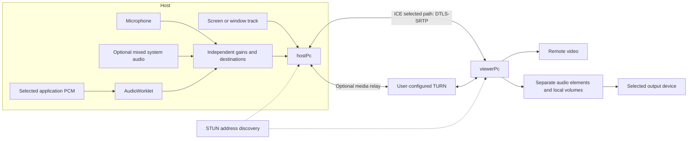
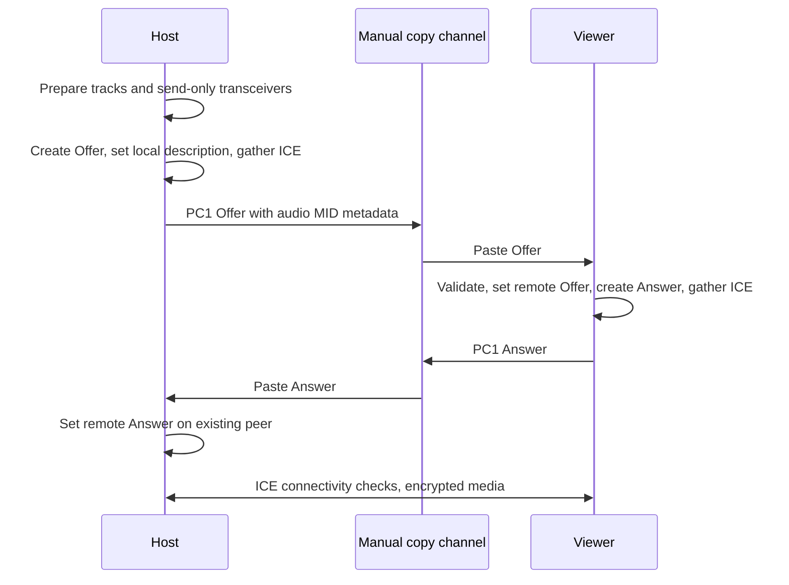
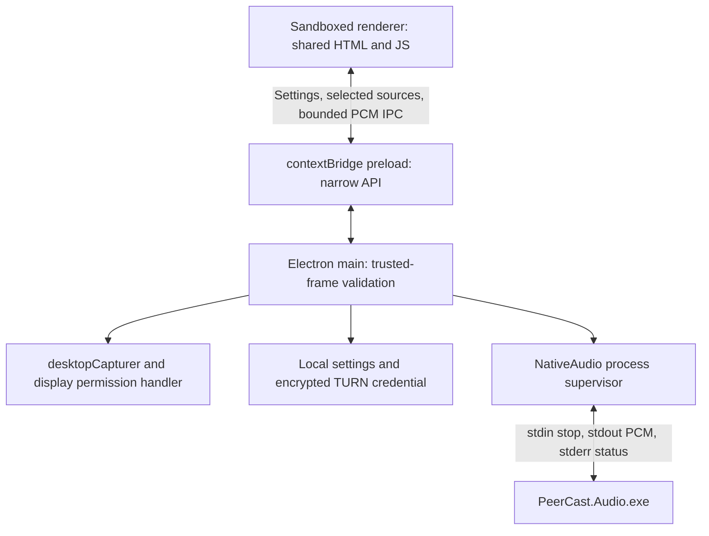

# Architecture and design decisions

## Shared WebRTC core

Each role owns one peer per session. The same `hostPc` creates the Offer and
accepts the Answer; the same `viewerPc` accepts the Offer and creates the Answer.
The application waits for ICE gathering to complete before exporting. It does
not implement trickle signaling or silently replace a live peer.

`PC1:` is JSON → UTF-8 → gzip → Base64URL. Gzip integrity checks, a version
prefix, SDP type validation and a decompression size limit reject malformed
input. Compression reduces copy length; it is **not encryption**. Raw JSON
remains available for compatible clients and debugging. SDP contains network
information and must be exchanged through a trusted channel.

ICE chooses a working candidate pair. `host` candidates support local paths;
STUN discovers `srflx` public mappings; TURN produces `relay` candidates.
STUN does not carry media. When configured and selected, TURN does relay media.
Route classification is based on reported selected candidates and remains
Unknown when evidence is insufficient. STUN alone cannot traverse every NAT.

## Electron boundary

Renderers have no Node.js access. Main checks the sender and main-frame page;
native capture endpoints are Host-only. External windows and navigation are
blocked. Production pages have a self-only CSP. Display capture requires an
explicit source selection and user gesture; microphone access asks permission.

Desktop loads local files and needs no HTTP server. The Web edition serves the
same root files, without the preload bridge or native helper. Settings are local:
Web uses localStorage; Desktop writes JSON atomically and encrypts TURN credentials
with Electron safeStorage on Windows. Startup is OFF unless explicitly enabled.

### Why Electron rather than Tauri?

Both can reuse HTML and integrate native code. Tauri would normally offer a
smaller distribution by using the installed WebView2 runtime. For this prototype,
Electron's bundled Chromium and documented display-capture interception reduce
capture-engine variation while retaining the tested browser WebRTC code.
The C# helper keeps WASAPI independent of either shell.

The tradeoff is a larger installer and Chromium process overhead. No comparative
memory benchmark was performed; this project does not claim Electron is more
memory-efficient. electron-builder provides the assisted NSIS installer. Update
delivery could be added later, but is not implemented in this alpha.

References: [Electron desktopCapturer](https://www.electronjs.org/docs/latest/api/desktop-capturer),
[Tauri WebView versions](https://v2.tauri.app/reference/webview-versions/).

## Windows application audio

The helper enumerates render-device audio sessions through
`IAudioSessionManager2`, associates them with PID and process creation time, and
captures a selected process tree through `ActivateAudioInterfaceAsync` with
`PROCESS_LOOPBACK_MODE_INCLUDE_TARGET_PROCESS_TREE`.

This is real process loopback. It does not separate an already mixed system
stream. Selecting application capture turns System Audio Send off to avoid
reintroducing excluded applications. Re-enabling mixed System Audio can include
those applications again; the UI warns about this.

PCM is 48 kHz, stereo, signed 16-bit little-endian. Each selected process has a
helper, bounded IPC delivery, a bounded AudioWorklet ring buffer, a separate gain
and a separate MediaStreamDestination. The Offer maps each audio transceiver MID
to its source label. The Viewer attaches each source to its own audio element.

- Send OFF detaches that sender and stops its native capture.
- Mute keeps the source but sets its gain to zero.
- Volume changes only that source's gain; Viewer volume is local.
- Stop/reset/navigation closes peers, tracks, contexts and native sessions.
- A PID is checked with its creation time to guard against PID reuse.
- Newly selected sources after negotiation require a fresh Offer/Answer.

Process trees and audio sessions are not always the same as an application's
marketing name. Multi-process applications can expose several sessions. Device
changes and process restarts are monitored but still need hardware acceptance.

Reference: [Microsoft application loopback sample and requirements](https://learn.microsoft.com/en-us/samples/microsoft/windows-classic-samples/applicationloopbackaudio-sample/).

## Repository map

| Path | Responsibility |
| --- | --- |
| Root HTML/CSS | Home, Host, Viewer, Settings, About; stable Web entry points |
| `host.js`, `viewer.js` | Role lifecycle, signaling and media controls |
| `common.js`, `compact.js` | Clipboard, SDP validation, ICE completion, PC1 codec |
| `audio.js`, `applications.js`, `pcm-worklet.js` | Independent audio graph and native PCM adapter |
| `settings*.js`, `metrics.js` | Local configuration and actual media statistics |
| `desktop/` | Electron main/preload, helper supervisor, icon, NSIS extension |
| `native/PeerCast.Audio/` | Self-contained .NET helper and Windows COM interop |
| `scripts/` | Build and publication checks |
| `tests/` | Dependency-free checks and real browser/desktop test harnesses |
| `docs/` | Architecture, verification, screenshots and contributor guidance |

Root web files deliberately remain in place to preserve existing URLs and avoid
introducing a bundler or a second implementation during publication cleanup.
